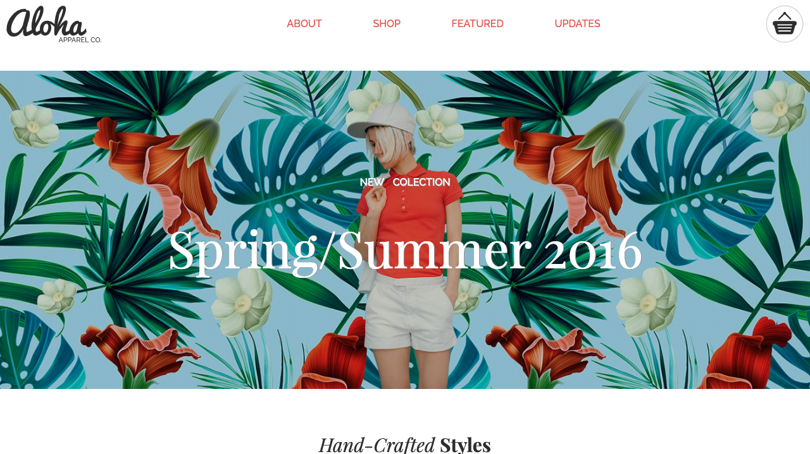

# Aloha-Page

Homepage for an e-commerce the Aloha Apparel. This website implement responsive design which adapt to different kind of screens.

## DESCRIPTION

 This project follows the design on the assest folder.
 According to the three images whose follows different screen's types.


## HOW TO USE IT?

+ Clone the project
+ Open `index.html` file
+ Enjoy it!
 
## Technologies used

+ [FlexBox](https://www.w3schools.com/css/css3_flexbox.asp): To create the layout of the main bar and product section.
+ Style is in `style.css` 
+ Reset css from [Meyer Reset](https://meyerweb.com/eric/tools/css/reset/) `meyerReset.css`
+ Flickity-docs for the carrousel get it from [Flickity](https://flickity.metafizzy.co).In order to follow the design requirements, the Flickity functionalities were downloaded and the customize the width of the box to get the correct view on each version.
+ Email validation using [JavaScript](https://www.javascript.com/)


## DEVELOPMENT STAGES

Due the difference screen's types the project was developed using FLEX-BOX.

1. Create the DOM the page should follow.

```
<html>---<head>---<header>---<body>---<footer>
                               !
                               !
                               !
  <section>SHOP <section>ABOUT<section>SHOP <section>UPDATES
                             
                               
```
2. Create Mobile version first, width less than 600px`.


3. In most cases every section use flexbox, so items adapt the screen size.

4. For feature part I used [Flickity](https://flickity.metafizzy.co) to create the products carrousel, download the files and follow the steps.

5. Adapt to tablet and desktop version with the follow queries

``@media screen and (min-width: 600px)  {  }``


``@media screen and (min-width: 1240px)  {  }``





